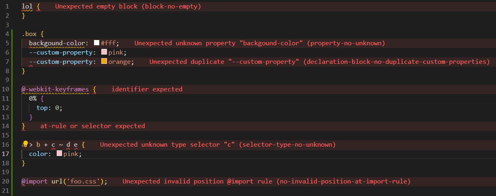

# UpLeveled Stylelint Config

UpLeveled Stylelint defaults for styling in CSS, SCSS, Sass, CSS Modules and CSS-in-JS.

## Setup

Follow the installation instructions for the [UpLeveled Bootcamp ESLint configuration](https://www.npmjs.com/package/@upleveled/eslint-config-upleveled)
